# 0. Review

이전 장에서 다룬 내용들 중 중요하게 봐야할 내용을 아래와 같이 정리해보았습니다.

* 강화학습에서는 보편적으로 2가지 유형의 문제를 해결합니다.
	* 정책평가: 정책 $\pi$가 주어졌을 때 그 정책의 가치함수 $v_{\pi}(s)$ 또는 $q_{\pi}(s, a)$를 구하는 문제
	* 정책제어: 정책을 조정하여 최적 정책을 만드는 문제(최종적으로 해결할 문제이기도 함)
<br>

* 앞서 에이전트의 상태에 대한 가치 함수는 아래와 같이 정의했습니다. <br><br>
$v_{\pi}(s) = \mathbb{E}\[R_t + \gamma R_{t+1} + {\gamma}^{2} R_{t+2} + ... |S_t = s\]$
<br><br>

* 하지만, 위와 같이 무한대가 포함된 식은 일반적으로 계산할 수 없기 때문에, 이를 해결한 방법이 **벨만 방정식**입니다. <br><br>
$v_{\pi}(s) = \sum_{a}{\pi(a|s)} \sum_{s'}{p(s'|s,a){r(s,a,s') + {\gamma}v_{\pi}(s')}}$
<br><br>

* 벨만 방정식을 통해 연립 방정식을 얻어, 에이전트의 상태 전이 확률, 보상함수, 정책 정보를 계산할 수 있습니다.
<br>

* 하지만, 상태와 행동 패턴 수가 조금만 많아져도 계산이 복잡하다는 단점이 존재했으며, 이를 해결하기 위해 등장한 것이 **"동적 프로그래밍"** 기법입니다.
	* 동적 프로그래밍은 **"대상 문제를 작은 문제로 나누어 답을 구하는 기법"들을 총칭하는 말**로, **"같은 계산을 두 번 이상 하지 않는 것"이 핵심**입니다.
	* 구현 방식에 따라 **"하향식(Top-Down)"** 과 **"상향식(Bottom-Up)"** 으로 구분하며, 아래 기초에 대한 설명에서는 상향식을 사용하였습니다.


# 1. 동적 프로그래밍 기초

* 동적 프로그래밍에서도 벨만 방정식을 이용하며, 정확히는 "갱신식"으로 변형됩니다. <br>

	$V_{k+1}(s) = \sum_{a}{{\pi}(a|s)} \sum_{s'} {p(s'|s,a)} \\{r(s,a,s') + {\gamma} V_k(s')\\}$
<br><br>

* 위의 식은 $k+1$번째의 갱신된 가치 추정 함수를 갱신하기 위해, $k$번째의 가치 추정 함수 $V_{k}(s')$ 을 사용하는 부트스트래핑 기법을 사용합니다.

* 구체적인 과정은 다음과 같습니다. 
	* 초기 상태의 가치 추정 함수 $V_0(s)$의 초기값을 설정
	* 위의 $V_{k+1}(s)$ 식을 이용해 $V_0(s)$에서 $V_1(s)$로 갱신
	* 두 번째 과정을 반복 수행하며, 목표인 $V_{\pi}(s)$로 수렴

* 위의 과정대로 구현을 하다보면, 반복되는 갱신과정을 멈춰야할 때가 오는데, 이를 확인하는 기준으로, "갱신된 양"을 이용할 수 있습니다. 관련 내용은 이 후에 다루도록 하겠습니다.


# 2. 반복 정책 평가: 두 칸 그리드 월드 구현하기

* 이전 벨만 방정식에서 다룬 **"두 칸 그리드 월드"** 를 예시로 보겠습니다. 


<br>

* 내용을 정리해보면, 다음과 같습니다.
	* 먼저 그림과 같이, 에이전트는 무작위 정책 $\pi$에 따라 행동하며, 위의 문제에서는 "임의의 상태 $s$ 에서 행동 $a$를 수행하면 다음 상태 $s'$ 한 가지"이므로 , 다음 상태인 $s'$ 이 함수 $f(s, a)$에 의해 고유하게 결정됩니다.
	* 때문에, $\sum_{s'}$ 처럼 모든 상태에 대한 합을 구할 필요 없이 하나의 $s'$에 대해서만 계산합니다.<br><br>
	  $V_{k+1}(s)=\sum_{a}{\pi}(a|s)\{r(s,a,s') + {\gamma} V_{k}(s')\}$
<br>

* 다음으로 초기값은 아래와 같이 설정합니다. <br><br>
$V_{0}(L1)=0$ <br>
$V_{0}(L2)=0$
<br><br>	

* 위 문제에 대한 백업 다이어그램은 다음과 같습니다.

```mermaid
flowchart TB
    %% Nodes
    A((L1))

    %% Left branch
    A -- "0.5" --> Ldot(( ))
    style Ldot fill:#333,stroke:#333,stroke-width:2px
    Ldot -- "Left" --> L1((L1))
    L1 --> Rneg((보상 : -1))

    %% Right branch
    A -- "0.5" --> Rdot(( ))
    style Rdot fill:#333,stroke:#333,stroke-width:2px
    Rdot -- "Right" --> L2((L2))
    L2 --> Rpos((1))

    %% Styles for reward bubbles
    classDef reward fill:#dff0ff,stroke:#6aa7ff,color:#000;
    class Rneg,Rpos reward;

    %% Optional: make reward links dashed
    linkStyle 4 stroke-dasharray: 5 5;
    linkStyle 5 stroke-dasharray: 5 5;

```

<br>

* 위의 다이어그램에서 왼쪽으로 가는 행동을 선택하는 경우 아래와 같이 계산할 수 있습니다. <br><br>
$0.5 \cdot \\{-1+0.9V_{0}(L1)\\}$
<br><br>

* 다음으로 오른쪽으로 가는 행동을 선택하는 경우 아래와 같이 계산할 수 있습니다. <br><br>
$0.5 \cdot \\{1 + 0.9V_{0}(L2)\\}$
<br><br>

* 위의 2개 식을 이용해 $V_{1}(L1)$과 $V_{1}(L2)$을 다음과 같이 구할 수 있습니다. <br><br>
$V_{1}(L1) = 0.5 \cdot \\{-1+0.9V_{0}(L1)\\} + 0.5 \cdot \\{1+0.9V_{0}(L2)\\}$ <br>
$= 0.5(-1 + 0.9 \cdot 0) + 0.5(-1 + 0.9 \cdot 0)$ <br>
$=0$
<br><br>	

	$V_{1}(L2) = 0.5 \cdot \\{0 + 0.9V_{0}(L1)\\} + 0.5 \cdot \\{-1 + 0.9V_{0}(L2)\\}$ <br>
	$=0.5(0 + 0.9 \cdot 0) + 0.5(-1 + 0.9 \cdot 0)$ <br>
	$=-0.5$
<br><br>

* 위의 과정대로 모든 상태에 대한 가치 함수 갱신을 반복하면 됩니다. 이를 파이썬 코드로 구현하면 다음과 같습니다.
	```python
	V = {'L1':0.0, 'L2':0.0}
	new_V = v.copy
	
	cnt = 0  # 갱신 횟수 기록
	while True:
		new_V['L1'] = 0.5 * (-1 + 0.9 * V['L1']) + 0.5 * (1 + 0.9 * V['L2'])
		new_V['L2'] = 0.5 * (0 + 0.9 * V['L1']) + 0.5 * (-1 + 0.9 * V['L2'])
		
		# 갱신된 양의 최대값
		delta = abs(new_V['L1'] - V['L1'])
		delta = max(delta, abs(new_V['L2'] - V['L2']))
		
		V = new_V.copy()
		
		cnt += 1
		if delta < 0.0001:  # 임계값 = 0.0001
			print(V)
			print("갱신 횟수: ", cnt)
			break
	```

* 위의 코드에서는 new_V라는 변수에 값을 업데이트하는 방식으로 구현했는데, 이를 딕셔너리 객체 1개만으로 구현하는 것도 가능합니다.
	```python
	V = {'L1':0.0, 'L2':0.0}

	cnt = 0
	while True:
		t = 0.5 * (-1 + 0.9 * V['L1']) + 0.5 * (1 + 0.9 * V['L2'])
		delta = abs(t - V['L1'])
		V['L1'] = t
	
		t = 0.5 * (0 + 0.9 * V['L1']) + 0.5 * (-1 + 0.9 * V['L2'])
		delta = max(delta, abs(t - V['L2']))
		V['L2'] = t
	
		cnt += 1
		if delta < 0.0001:
			print(V)
			print("갱신 함수: ", cnt)
			break
	```

	```text
	여담으로 위의 코드에서 사용된 while  재귀함수로 구현해봤는데, 76회가 나오더라고요😂
	궁금하신 분들은 도전해보시는 것도 좋을 것 같습니다.
	```


# 3. 반복 정책 평가: $3 \times 4$ 그리드 월드 구현하기

* 앞서 본 알고리즘을 이용하면 상태와 행동 패턴의 수가 많아져도 빠르게 연산할 수 있습니다. 이를 위해, 이번에는 "$ 3 \times 4$ 그리드 월드" 라는 문제를 풀어보도록 하겠습니다.

* TODO: 그림4-8 추가

* 이번 문제에 대한 설정들은 다음과 같습니다. 
```text
1. 에이전트는 상하좌우 이동가능함
2. 그림처럼 회색 칸은 벽을 의미하며, 벽을 통과하거나 안으로 들어갈 수 없음
3. 그리드 외벽은 둘러싸여 나갈 수 없으며, 벽에 부딪히면 보상은 0임
4. 사과는 보상 +1, 폭탄은 보상 -1, 그 외의 보상은 0임
5. 환경 상태 전이는 고유함 / 에이전트 이동방향에 벽이 없다면, 반드시 해당 방향으로 이동함
6. 일회성 문제로, 사과를 얻으면 종료함
```

* 전반적인 코드는 "gridworld.py" 를 참고바라며, 아래에서는 코드 상 주요한 부분에 대해서만 짚고 넘어가도록 하겠습니다. 

* **@property 데코레이터 사용**
	  아래 예시와 같이 메소드명 위에 추가할 경우, 해당 메소드를 변수처럼 사용할 수 있습니다.
```python
@property
def height(self):
	return len(self.reward_map)
	
...

for h in range(self.height):
	...
```

* **defaultdict() 사용법**
	* 파이썬 표준 라이브러리 중 "collections" 라이브러리 하위에 있는 라이브러리입니다.<br>
	<br>
	
	* 파이썬에서 기본으로 제공되는 자료구조 중 하나인 사전(Dictionary, 딕셔너리)은 해당 딕셔너리 안에 존재하는 모든 key가 존재해야하고, 모든 원소를 초기화해야하는 번거로움이 존재합니다.<br>
	<br>
	
	* 이러한 초기화의 번거로움을 덜어주기 위해 추가된 표준 라이브러리가 defaultdict입니다.<br>
	<br>
	
	* 아래 코드에서처럼 defaultdict() 함수를 사용하면 되고, 매개변수로는 초기값을 아래와 같이 지정해주면 됩니다. 또한 딕셔너리 객체에 존재하지 않는 (key, Value) 형태를 매개변수로 넘기면, 원소를 새로 만들어 넣습니다.<br>
	```python
	from collections import defaultdict
	
	V = defaultdict(lambda: 0) 
	pi = defaultdict(lambda: {0: 0.25, 1: 0.25, 2: 0.25, 3: 0.25})
	```


# 4. 정책 반복법

* 글의 시작에서도 나왔듯이, 강화학습의 최종 목표는 "최적 정책 찾기"입니다. 이전까지 반복적으로 정책을 평가하였으니, 이제 어떻게 개선할 수 있는지를 살펴보겠습니다. <br>

* 먼저 3장에서 나온 내용 중 최적 정책 $\mu_{\*}$에 대한 식을 복기해봅시다. <br><br>
  $\mu_{\*}(s) = \underset{a}{\arg\max} q_{\*}(s,a)$ <br>
  $= \underset{a}{\arg\max} \sum_{s'}{p(s'|s,a)\\{r(s,a,s') + {\gamma} v_{\*}(s')\\}}$ <br>


* 위의 수식에서 $argmax_{a}$연산이 최적정책을 찾아주며, 일부 후보 행동들을 대상으로 최선의 선택하기에 "탐욕 정책(Greedy Policy)"라고 부릅니다.

* 만약, 임의의 정책 $\mu$에 대해서 새로운 정책 ${\mu}'$을 표현을 해보자면, 아래 수식과 같이 나타낼 수 있습니다. <br><br>
  ${\mu}'(s) = \underset{a}{\arg\max} q_{\mu}(s,a)$ <br>
  $= \underset{a}{\arg\max} \sum_{s'}{p(s'|s,a)\\{r(s,a,s') + {\gamma} v_{\mu}(s')\\}}$ <br>


* 위의 수식을 이용한 정책 갱신 방법을 "탐욕화" 라고 하며, 모든 상태 $s$에서 $\mu(s)$와 ${\mu}'(s)$ 가 같다면, $\mu(s)$는 최적 정책을 만족한다는 특징이 있습니다.
  * 아래 수식의 결과가 $\mu(s)$라면, 결국 갱신이 일어나지 않은 것과 같으며, 갱신이 일어나지 않으려면 정책이 최적 정책인 경우에만 가능하기 때문입니다.
  ${\mu}'(s) = \underset{a}{\arg\max} q_{\mu}(s,a)$ <br>

  * 이는 탐욕화의 결과로 정책이 갱신된다면, 새로운 정책은 항상 기존의 정책보다 개선된다는 점까지 확인할 수 있습니다.(=모든 상태 $s$에 대해 $v_{{\mu}'}(s) \geq v_{\mu}(s)$ )
<br>

* 결과적으로 아래 그림과 같은 과정이 반복되면서 최적 정책을 찾아내는 과정을 가리켜 "정책 반복법"이라고 부릅니다.
                                                                                                                                     

  
# 5. 가치 반복법


