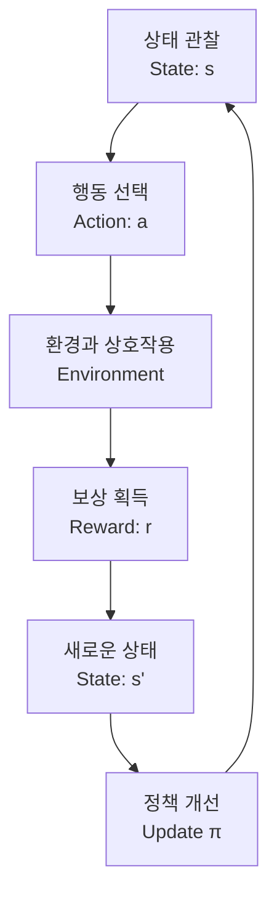
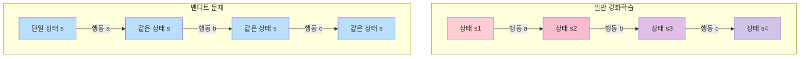
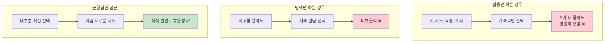
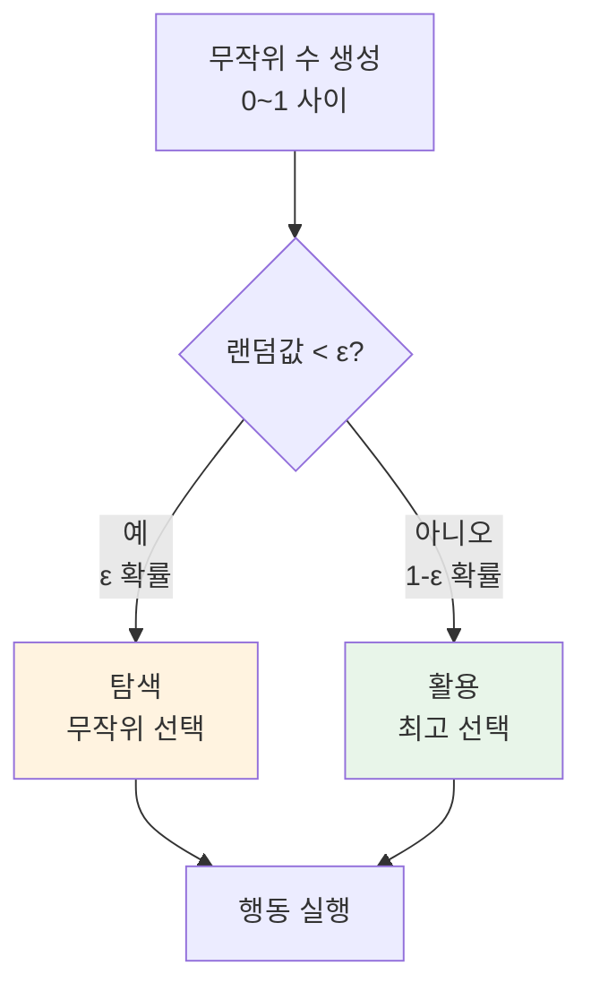
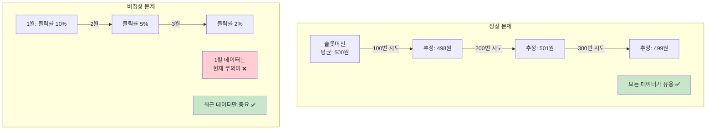

# 밴디트 문제로 시작하는 강화학습 입문

## 1. 강화학습(Reinforcement Learning) 개념

강화학습은 **시행착오를 통해 학습**하는 기계학습 방법입니다. 에이전트가 환경과 상호작용하면서 보상을 최대화하는 방법을 스스로 배워나갑니다.


### 핵심 구성요소

**1. 에이전트(Agent)**
- 학습하고 행동하는 주체 (예: 게임 플레이어, 로봇)

**2. 환경(Environment)**
- 에이전트가 상호작용하는 대상 (예: 바둑판, 미로)

**3. 상태(State, s)**
- 현재 상황을 나타내는 정보
- 체스: 말들의 위치
- 자율주행: 센서 데이터

**4. 행동(Action, a)**
- 에이전트가 취할 수 있는 선택
- 게임: 상/하/좌/우 이동
- 주식: 매수/매도/보유

**5. 보상(Reward, r)**
- 행동에 대한 즉각적인 피드백
- 긍정적 보상: +1 (좋은 행동)
- 부정적 보상: -1 (나쁜 행동)

**6. 정책(Policy, π)**
- 상태에서 어떤 행동을 선택할지 결정하는 전략
 
 
### 학습 과정




##### **예시) 강아지 훈련**

- 상태: 강아지가 앉아있음
- 행동: "손" 명령
- 보상: 손 주면 간식(+1), 안 주면 간식 없음(0)
- 학습: 점점 "손" 명령에 발 내밀기를 학습

---

## 2. 기계학습 방법론 비교

| 구분          | **지도학습**                | **비지도학습**           | **강화학습**                       |
| ----------- | ----------------------- | ------------------- | ------------------------------ |
| **학습 데이터**  | 입력 + 정답(레이블)            | 입력                  | 상태 + 행동 + 보상                   |
| **목표**      | 입력 → 출력<br>매핑 학습        | 데이터의 숨은 패턴 발견       | 누적 보상 최대화                      |
| **피드백**     | 즉각적 (정답 제공)             | 없음                  | 지연된 보상 신호                      |
| **학습 방식**   | 정답과 예측 차이 최소화           | 데이터 구조/분포 파악        | 시행착오 통한 개선                     |
| **탐색 필요성**  | 불필요                     | 불필요                 | 필수 (exploration)               |
| **대표 알고리즘** | - CNN<br>- RNN<br>- SVM | - K-means<br>- PCA  | - Q-Learning<br>- Actor-Critic |
| **활용 분야**   | - 이미지 분류<br>- 스팸 필터     | - 고객 세분화<br>- 이상 탐지 | - 게임 AI<br>- 로봇 제어             |
| **예시 문제**   | "이 사진은 고양이인가?"          | "비슷한 고객끼리 그룹화"      | "미로에서 출구 찾기"                   |

---

## 3. 밴디트 문제: 강화학습의 가장 단순한 형태

### 밴디트 문제란?

카지노에 3개의 슬롯머신이 있다고 상상해보세요:

```
슬롯머신 A: 당길 때마다 평균 200원 (하지만 모름)
슬롯머신 B: 당길 때마다 평균 500원 (하지만 모름) ← 최적!
슬롯머신 C: 당길 때마다 평균 300원 (하지만 모름)

문제: 100번의 기회가 있을 때, 어떻게 최대 수익을 얻을까?
- 처음엔 어느 슬롯머신이 좋은지 모름
- 시도해보면서 파악해야 함
- 하지만 시도 자체도 기회를 소비함
```

**"최적 팔(Optimal Arm)"**: 평균 보상이 가장 높은 슬롯머신 (위 예시에서는 B)

### 강화학습 vs 밴디트 문제



| 구분            | **일반적인 강화학습**              | **밴디트 문제**     |
| ------------- | -------------------------- | -------------- |
| **상태(State)** | 1. 여러 상태 존재<br>2. 상태 전이 발생 | **단일 상태만 존재**  |
| **행동의 영향**    | 행동이 다음 상태에 영향              | 행동이 상태를 바꾸지 않음 |
| **보상**        | 즉각적 + 미래 보상 고려             | **즉각적 보상만 고려** |
| **의사결정**      | 순차적 의사결정                   | 독립적인 의사결정      |
| **학습 목표**     | 최적 정책(π) 학습                | 최적 팔 찾기        |

---
## 4. 탐색과 활용 딜레마

강화학습의 핵심 문제: **"모험을 할까, 안전하게 갈까?"**

### 탐색 (Exploration) - 모험

- **정의**: 잘 모르는 선택지를 시도
- **목적**: 더 좋은 선택지 발견
- **리스크**: 당장은 손해 가능

### 활용 (Exploitation) - 안전

- **정의**: 현재 알고 있는 최선의 선택
- **목적**: 확실한 보상 획득
- **리스크**: 더 좋은 기회 놓칠 수 있음

### 왜 둘 다 필요한가?



---
## 5. ε-greedy 알고리즘

탐색-활용 딜레마를 해결하는 가장 **직관적인 방법**

### 작동 원리



### 실제 동작 예시

```python
ε = 0.1 (10% 탐색, 90% 활용)

현재까지 파악한 평균:
슬롯 A: 150원 (5번 시도)
슬롯 B: 450원 (8번 시도) ← 현재 최고!
슬롯 C: 280원 (4번 시도)

다음 선택:
- 주사위 굴림: 0.73 나옴
- 0.73 > 0.1 이므로 → 활용! → B 선택

만약 0.05가 나왔다면:
- 0.05 < 0.1 이므로 → 탐색! → A,B,C 중 랜덤
```

### ε 값 선택 가이드

|ε 값|특성|적합한 상황|
|---|---|---|
|0.01|1% 탐색, 99% 활용|충분히 학습된 후|
|0.1|10% 탐색, 90% 활용|일반적인 설정|
|0.3|30% 탐색, 70% 활용|초기 학습 단계|

---
## 6. 정상 vs 비정상 문제

### 환경 특성 비교

|구분|**정상 문제**|**비정상 문제**|
|---|---|---|
|**보상 분포**|시간이 지나도 고정|시간에 따라 변화|
|**예시**|일반 슬롯머신|사용자 선호가 바뀌는 추천 시스템|
|**최적 팔**|항상 동일|시간에 따라 바뀔 수 있음|

### 가치 업데이트 방식 - 상세 설명

#### 정상 문제: 표본평균 (Sample Average)

**수식:**

```
Qₙ₊₁(a) = Qₙ(a) + 1/n × [Rₙ - Qₙ(a)]
```

**의미:**

- `Qₙ(a)`: n번째 시도까지 행동 a의 추정 가치
- `Rₙ`: n번째 시도에서 받은 실제 보상
- `1/n`: 학습률 (시도 횟수가 늘수록 감소)

**전개하면:**

```
Qₙ(a) = (R₁ + R₂ + R₃ + ... + Rₙ) / n
```

모든 과거 보상의 단순 평균!

**예시:**

```
슬롯 A의 보상 기록: [100, 300, 200, 400]
Q₄(A) = (100 + 300 + 200 + 400) / 4 = 250원

5번째 시도에서 500원 획득:
Q₅(A) = Q₄(A) + 1/5 × [500 - 250]
      = 250 + 1/5 × 250
      = 250 + 50 = 300원
```

**특징:**

- n이 커질수록 새 데이터의 영향력 ↓
- 결국 진짜 평균으로 수렴
- 모든 과거 데이터를 동등하게 신뢰

#### 비정상 문제: 지수이동평균 (Exponential Moving Average)

**수식**

```
Qₙ₊₁(a) = Qₙ(a) + α × [Rₙ - Qₙ(a)]
```

**의미**

- `α` (알파): 고정 학습률 (보통 0.1)
- 최신 데이터에 일정한 가중치 부여

**전개하면**

```
Qₙ(a) = α×Rₙ + (1-α)×α×Rₙ₋₁ + (1-α)²×α×Rₙ₋₂ + ...
```

**가중치 패턴 (α=0.1)**

```
현재 보상:   0.1
1단계 전:    0.09
2단계 전:    0.081
3단계 전:    0.0729
...
10단계 전:   0.0349 (약 3.5%)
```

**예시**

```
광고 클릭률이 변하는 상황 (α = 0.1)

초기: Q(광고A) = 5%
시간 경과 후 트렌드 변화로 실제 클릭률 10%로 상승

새 데이터: 10% 클릭
Q_new = 5% + 0.1 × (10% - 5%)
      = 5% + 0.5%
      = 5.5%

계속 10% 데이터가 들어오면:
시도 1: 5.5%
시도 2: 5.95%
시도 3: 6.36%
...점진적으로 10%에 근접
```

### 왜 이런 차이가 필요한가?



**정상 문제에서 표본평균**

- 시간이 지나도 진짜 평균은 동일
- 데이터 많을수록 정확도 ↑
- 수렴성 보장

**비정상 문제에서 지수이동평균**

- 환경이 변하므로 옛날 데이터는 오히려 해로움
- 최신 트렌드 빠르게 반영
- 변화에 적응 가능

---
## 7. 정리

1. **강화학습**: 시행착오로 배우는 AI
2. **밴디트 문제**: 상태 변화 없는 단순 강화학습
3. **탐색 vs 활용**: 모험과 안전의 균형
4. **ε-greedy**: 확률로 균형 맞추기
5. **정상 vs 비정상**:
    - 정상: 표본평균으로 모든 데이터 활용
    - 비정상: 지수이동평균으로 최신 데이터 중시
