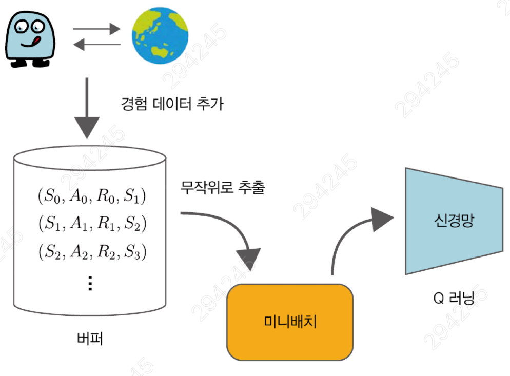

# 8장

# DQN (Deep Q-Network)

## **1. 신경망 기반 Q러닝의 한계**

7장의 Q함수를 신경망으로 근사하는 방식은 여러 복합적인 문제로 인해 학습이 불안정해지기 쉬움. DQN은 이러한 문제들을 해결하는 데 중점을 둠.

### **샘플 간의 강한 상관관계 (Correlation)**

- 강화학습은 시간 순서대로 연속된 데이터를 학습에 사용함.
- 이 데이터들은 서로 매우 유사(상관관계가 높음).

### **정답 레이블의 불안정성 (부트스트래핑 문제)**

- Q러닝(및 TD 학습)은 근본적으로 **부트스트래핑(Bootstrapping)** 방식을 사용함. 이는 아직 정확하지 않은 추정치 를 이용해 현재의 추정치를 갱신하는 것을 의미.
- **정답이 되는 값 자체가 부정확한 추정치**이기 때문에 불안정성을 내포함.
- 7장의 구현에서는 Q값을 예측하는 신경망과 '정답'을 계산하는 신경망이 동일한 self.qnet이라서 불안정함.
- 즉, 학습(업데이트)으로 인해 Q(S_t, a_t)를 예측하는 신경망의 가중치가 변하면, 정답을 계산하는 기준(신경망)까지 함께 흔들리게 됨.
- 이는 학습 목표가 계속 바뀌는 것과 같아 학습을 매우 불안정하게 만듦.

### **신경망의 표현력과 과적합 (Overfitting)**

- 신경망은 **표현력이 높다**는 것이 큰 장점이지만, 이것이 오히려 단점이 될 수 있음.
- 표현력이 너무 높으면, 학습 과정에서 경험한 제한된 데이터(샘플)에만 지나치게 잘 맞춰지는 과적합(Overfitting)이 발생하기 쉬움.

## 2. DQN의 핵심 기법

DQN은 위 두 가지 문제를 해결하기 위해 두 가지 핵심 기법을 도입함.

### 2.1 경험 재생 (Experience Replay)

- 에이전트가 환경에서 겪는 경험 `(s, a, r, s', done)`을 바로 학습에 사용하지 않고, 리플레이 버퍼(Replay Buffer)라는 큰 메모리 공간에 저장함.
- 학습(업데이트)이 필요할 때마다, 이 리플레이 버퍼에서 **무작위로 미니배치를 샘플링**하여 학습에 사용함.
    
    
    
- **효과**
    - 시간 순서에 따른 샘플 간의 상관관계를 깨뜨려, 편향이 적은 데이터 얻을 수 있음.
    - 경험 데이터를 반복해서 사용할 수 있어서 데이터 효율이 높아짐.

### 리플레이 버퍼 구현 예시

```python
from collections import deque
import random
import numpy as np

class ReplayBuffer:
		#버퍼크기, 미니배치 크기 초기화
    def __init__(self, buffer_size, batch_size):
        self.buffer = deque(maxlen=buffer_size)
        self.batch_size = batch_size
		
		#경험 데이터 추가 함수
    def add(self, state, action, reward, next_state, done):
        data = (state, action, reward, next_state, done)
        self.buffer.append(data)
        
		#버퍼크기 반환 함수
    def __len__(self):
        return len(self.buffer)
		
		#버퍼의 데이터에서 미니배치 생성하는 함수
    def get_batch(self):
        data = random.sample(self.buffer, self.batch_size)

        state = np.stack([x[0] for x in data])
        action = np.array([x[1] for x in data])
        reward = np.array([x[2] for x in data])
        next_state = np.stack([x[3] for x in data])
        done = np.array([x[4] for x in data]).astype(np.int32)
        return state, action, reward, next_state, done
```

---

### <카트 폴>환경에 적용 코드

```python
import gym

env = gym.make('CartPole-v0', render_mode='human')
replay_buffer = ReplayBuffer(buffer_size=10000, batch_size=32)

for episode in range(10):  #에피소드 10회 수행
    state = env.reset()[0]
    done = False

    while not done:
        action = 0  #항상 0번째 행동만 수행
        
        # ③ 경험 데이터 획득
        next_state, reward, terminated, truncated, info = env.step(action)
        done = terminated | truncated

        replay_buffer.add(state, action, reward, next_state, done) # ④ 버퍼에 추가
        state = next_state
        
#경험 데이터 버퍼로부터 미니배치 생성
state, action, reward, next_state, done = replay_buffer.get_batch()

print(state.shape)      # [출력 결과] (32, 4)
print(action.shape)     # [출력 결과] (32,)
print(reward.shape)     # [출력 결과] (32,)
print(next_state.shape) # [출력 결과] (32, 4)
print(done.shape)       # [출력 결과] (32,)
```

### 2.2 목표 신경망 (Target Network)

- **지도 학습 (Supervised Learning):** 학습 데이터의 정답 레이블이 고정되어 있음. (예: MNIST '7' 이미지는 항상 '7'이라는 정답 레이블을 가짐)
- **Q 러닝 (Q-Learning):** 정답 레이블에 해당하는 TD 목표가 학습 과정에서 계속 변함.
- **원인**
    - TD 목표를 계산하는 데 사용되는 Q 함수(신경망) 자체가 매번 갱신되기 때문.
    - 움직이는 과녁을 맞추는 것과 같아 학습이 매우 불안정해짐.

- **해결책: 목표 신경망 도입**
    - 핵심 아이디어는 TD 목표를 일정 기간 동안 고정시키는 것임.
- **작동 방식**
    - 목표 신경망은 두 개의 신경망으로 구성됨.
        - **원본 신경망 (qnet):**
            ◦ 일반적인 Q 러닝 방식대로 학습 데이터(경험)가 생길 때마다 즉시 갱신됨.
            ◦ 에이전트의 실제 행동을 결정하는 데 사용됨.
        - **목표 신경망 (qnet_target):**
    - 원본 신경망과 동일한 구조를 가짐.
    - 이 신경망의 가중치는 고정된 상태로 유지됨.
    - 오직 TD 목표값을 계산하는 용도로만 사용됨.
    - 아래 식을 계산하여 정답 레이블을 만듦.
        
        
        

- **핵심: 주기적인 갱신**
    - 목표 신경망(qnet_target)의 가중치를 고정시키면, TD 목표값이 흔들리지 않아 신경망 학습이 안정화됨.
    - 단, 목표 신경망의 가중치가 전혀 갱신되지 않으면 Q 함수의 학습이 제대로 진행되지 않음.
    - 따라서, 주기적으로 (예: 100 에피소드마다) 원본 신경망(qnet)의 가중치를 목표 신경망(qnet_target)으로 복사(동기화)여 목표 신경망을 갱신함.

- 목표 신경망 구현

```python
import copy
from dezero import Model
from dezero import optimizers
import dezero.functions as F
import dezero.layers as L

class QNet(Model):  #신경망 클래스
    def __init__(self, action_size):
        super().__init__()
        self.l1 = L.Linear(128)
        self.l2 = L.Linear(128)
        self.l3 = L.Linear(action_size)

    def forward(self, x):
        x = F.relu(self.l1(x))
        x = F.relu(self.l2(x))
        x = self.l3(x)
        return x

class DQNAgent:  #에이전트 클래스
    def __init__(self):
        self.gamma = 0.98
        self.lr = 0.0005
        self.epsilon = 0.1
        self.buffer_size = 10000  #경험 재생 버퍼 크기
        
				self.batch_size = 32      #미니배치 크기
        self.action_size = 2

        self.replay_buffer = ReplayBuffer(self.buffer_size, self.batch_size)
        self.qnet = QNet(self.action_size)        #원본 신경망
        self.qnet_target = QNet(self.action_size) #목표 신경망
        self.optimizer = optimizers.Adam(self.lr)
        self.optimizer.setup(self.qnet)           #옵티마이저에 qnet 등록

    def sync_qnet(self):  #두 신경망 동기화
        self.qnet_target = copy.deepcopy(self.qnet)

    def get_action(self, state):
        if np.random.rand() < self.epsilon:
            return np.random.choice(self.action_size)
        else:
            state = state[np.newaxis, :]  #배치 처리용 차원 추가
            qs = self.qnet(state)
            return qs.data.argmax()
```

- 가중치 매개변수 갱신 메서드

```python
class DQNAgent:
    ...

    def update(self, state, action, reward, next_state, done):
        # 경험 재생 버퍼에 경험 데이터 추가
        self.replay_buffer.add(state, action, reward, next_state, done)
        if len(self.replay_buffer) < self.batch_size:
            return  # 데이터가 미니배치 크기만큼 쌓이지 않았다면 여기서 끝

        # 미니배치 크기 이상이 쌓이면 미니배치 생성
        state, action, reward, next_state, done = self.replay_buffer.get_batch()

        qs = self.qnet(state)  # ③
        q = qs[np.arange(self.batch_size), action]  # ④

        next_qs = self.qnet_target(next_state)  # ⑤
        next_q = next_qs.max(axis=1)
        next_q.unchain()
        target = reward + (1 - done) * self.gamma * next_q  # ⑥

        loss = F.mean_squared_error(q, target)

        self.qnet.cleargrads()
        loss.backward()
        self.optimizer.update()
```

- 신경망이 예측한 Q값들 중에서, 실제로 선택했던 행동의 Q값만 골라내는 과정
    
    
    

- DQNAgent 클래스를  <카트 폴>에 적용

```python
episodes = 300       # 에피소드 수
sync_interval = 20   # 신경망 동기화 주기(20번째 에피소드마다 동기화)
env = gym.make('CartPole-v0', render_mode='rgb_array')
agent = DQNAgent()
reward_history = []  # 에피소드별 보상 기록

for episode in range(episodes):
    state = env.reset()[0]
    done = False
    
    total_reward = 0

    while not done:
        action = agent.get_action(state)
        next_state, reward, terminated, truncated, info = env.step(action)
        done = terminated | truncated

        agent.update(state, action, reward, next_state, done)
        state = next_state
        total_reward += reward
    
    if episode % sync_interval == 0:
        agent.sync_qnet()

    reward_history.append(total_reward)
```

- 에피소드 총 300번 실행(에피소드 20마다 목표 신경망 동기화)
- 가로축 : 에피소드 수 / 세로 축 : 보상 합계
    
    
    
    
    

- **평가 방법:** 학습이 완료된 에이전트의 순수한 성능을 확인하기 위해, 탐색(Exploration)을 비활성화.
    - agent.epsilon = 0으로 설정하여, 에이전트가 더 이상 무작위 행동을 하지 않고 학습된 Q함수에 따라 최적의 행동(Greedy action)만 선택하도록 함.
- **테스트 코드:** 에이전트가 환경(env)이 끝날 때(done)까지 agent.get_action(state)로 행동을 받아(env.step) 총 보상을 계산함.
- **실행 결과:** Total Reward: 116
    - 테스트 결과 116점을 획득함.

## **3. DQN과 아타리**

- DQN은 'Playing Atari with Deep Reinforcement Learning'이라는 논문에서 제안된 기법.
- DQN은 'Xuan(아타리)'이라는 게임 회사가 만든 게임들을 학습 환경으로 사용함.
    - **NOTE:** DQN은 2013년 NIPS 워크숍에서 발표된 초기 버전과, 2015년 네이처에 실린 'human-level control through deep reinforcement learning' 논문 버전이 있음. 이 책은 2015년 네이처 논문을 기반으로 하며, 두 버전 간의 차이점(DQN의 확장 기법들)을 중심으로 설명함.

### **3.1 아타리 게임 환경**

- OpenAI Gym은 다양한 게임 환경을 제공 '벽돌 깨기(Breakout)' 게임을 예시로 사용함.
- 이 환경에서 관측값(Observation)은 게임 화면의 픽셀 이미지.

### **3.2 전처리 (Preprocessing)**

- **POMDP**
    - 아타리 환경은 MDP(마르코프 결정 과정)의 요건을 완벽히 충족하지 못함.
    - **해결책 (프레임 스태킹):** 이 문제를 해결하기 위해 DQN 논문에서는 연속된 4개의 프레임(이미지)을 묶어서 하나의 상태(state)로 처리함.
    - **기타 전처리:** 이미지를 흑백(Grayscale)으로 변환하고, 게임 점수판 등을 제외하도록 이미지를 자른 뒤(Cropping) 크기를 84x84로 조정하는 등의 전처리를 수행함.

### **3.3 CNN (합성곱 신경망)**

- 아타리처럼 원본 픽셀 이미지를 입력으로 사용할 때는 CNN을 사용함.
- DQN에서 사용하는 CNN의 구조를 보여줌.
    
    
    
- 중간층의 활성화 함수로는 ReLU를 사용
- 입력에 가까운 층에서는 합성곱 계층 사용, 출력에 가까운 층에서는 완전 연결 계층 사용.
- 마지막 출력층은 각 행동(action)에 대한 Q값을 출력하는 선형 함수(Linear)로 구성됨.

### **3.4 기타 아이디어 (Other Ideas)**

- DQN 논문에서 사용된 다른 주요 기법들.
- **GPU 사용:** 아타리 같은 이미지 기반 환경은 계산량이 많으므로, GPU(또는 TPU)를 사용하여 대규모 행렬 연산을 효율적으로 처리함.
- **epsilon 값 조정 (엡실론 감쇠):**
    - 강화 학습은 탐험(Exploration)과 활용(Exploitation)의 균형이 중요함.
    - 학습 초기: Q함수가 부정확하므로 epsilon 값을 높게(예: 1.0) 설정하여 무작위 행동(탐험)을 많이 하도록 함.
    - 학습 후기: 학습이 진행됨에 따라 epsilon 값을 점진적으로 낮춰(예: 0.1), 학습된 Q함수를 신뢰하여 최적의 행동(활용)을 하도록 함.
    - epsilon 값이 1M(백만) 스텝까지 1.0에서 0.1로 선형적으로 감소하는 것을 보여줌.
        
        
        
- **보상 클리핑 (Reward Clipping)**
    - **목적:** 아타리 게임들은 게임마다 보상의 스케일(크기)이 모두 다름. 이 스케일 차이가 학습에 영향을 미치는 것을 막기 위해 보상을 정규화함.
    - **방법:** DQN 논문에서는 모든 보상 값을 -1.0에서 1.0 사이로 강제로 제한(클리핑).

## **4. DQN 확장**

### **4.1 Double DQN**

- **문제점:** 표준 DQN은 TD 목표를 계산할 때 max 연산자는 Q값을 실제보다 과대평가(Overestimation)하는 경향이 있어 학습을 불안정하게 만듦.
    
    
    
- **해결책 (Double DQN):** Q값을 계산하는 신경망을 두 개로 분리하여 이 문제를 해결함.
- **작동 방식**
    - **행동 선택:** 현재의 원본 신경망(Q)을 사용하여, 다음 상태 S_t+1에서 Q값이 가장 커지는 행동 a를 선택함.
    - **가치 평가:** 위에서 선택한 행동 a를 목표 신경망에 넣어, 해당 행동의 Q값을 계산함.
    - **최종 TD 목표**
        
        
        
    - **효과:** 행동 선택과 가치 평가에 서로 다른 신경망을 사용하여 과대평가를 줄이고 학습을 안정화함.

### **4.2 우선순위 경험 재생 (PER)**

- **문제점:** 표준 DQN의 경험 재생(Experience Replay)은 버퍼에서 데이터를 무작위로 균등하게 샘플링함.
- **해결책 (PER):** TD 오차를 기준으로 데이터의 우선순위를 정함.


- **TD 오차:** 이 값의 절댓값이 크다는 것은 신경망의 예측과 실제 목표값 간의 차이가 크다는 뜻이며, 이는 학습할 가치가 높은 데이터임을 의미함.
- **작동 방식:** 이 TD 오차를 바탕으로 각 경험 데이터가 뽑힐 확률을 계산하고, 우선순위가 높은 데이터(TD 오차가 큰 데이터)를 더 자주 샘플링함.
    
    
    
- **효과:** 무작위 샘플링보다 적은 데이터로 더 빠른 학습 수렴을 기대할 수 있음.

### **4.3 Dueling DQN**

- **핵심:** Dueling DQN은 신경망의 구조를 개선한 기법.
- **구조:** Q함수를 가치 함수와 어드밴티지 함수의 차이.
    
    
    
    - **V(s) (가치 함수):** 상태 s 자체가 얼마나 좋은지(가치)를 나타냄. 행동과 무관함.
    - **A(s, a) (어드밴티지 함수):** 상태 s에서 행동 a를 하는 것이 평균적인 다른 행동보다 얼마나 더 좋은지(유리한지)를 나타냄.
    - **신경망 구조:** CNN 등 공통 네트워크를 거친 후, 망이 두 갈래로 나뉨. 한쪽은 V(s)를, 다른 쪽은 A(s, a)를 추정함. 마지막에 이 두 값을 다시 합쳐 최종 Q(s, a)를 계산함.
        
        
        
        - **장점:** 이 구조는 상태의 가치(V)와 행동의 가치(A)를 분리하여 학습함.
        - 어떤 행동을 해도 보상이 같거나, 벽에 충돌하기 직전이라 어떤 행동을 하든 나쁜 상황(V(s)가 낮음)에서는 V(s) 값만 학습하면 됨.
        - **효과:** 상태의 가치를 행동과 독립적으로 학습할 수 있어, V(s)가 더 정확하게 갱신되고 결과적으로 Q(s, a)의 학습 효율이 높아짐.